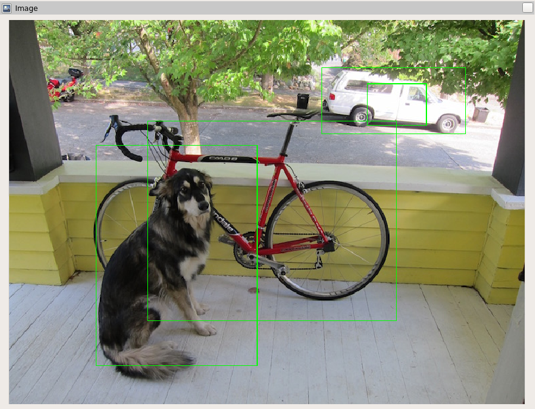

# Detection Visualizer

This package provides a ROS 2 node for visualizing computer vision detections.
It subscribes to an image topic and a detections topic, and outputs an image with bounding boxes drawn on it.
The output topic can be visualized in rviz.

# Topics

* `~/images` (Type `sensor_msgs/msg/Image`) - Input topic with images that have been given to a computer vision node
* `~/detections` (Type `vision_msgs/msg/Detection2DArray`) - Input topic with detections on the given image
* `~/dbg_image` (Type `sensor_msgs/msg/Image`) - Output topic which has bounding boxes drawn on it

It is assumed the image message and detections message have identical timestamps.

